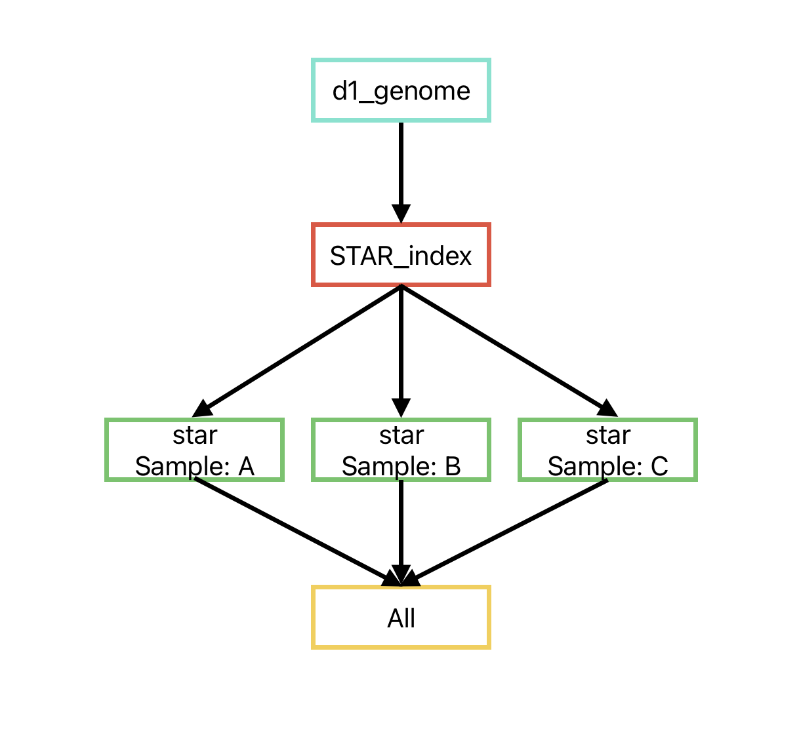
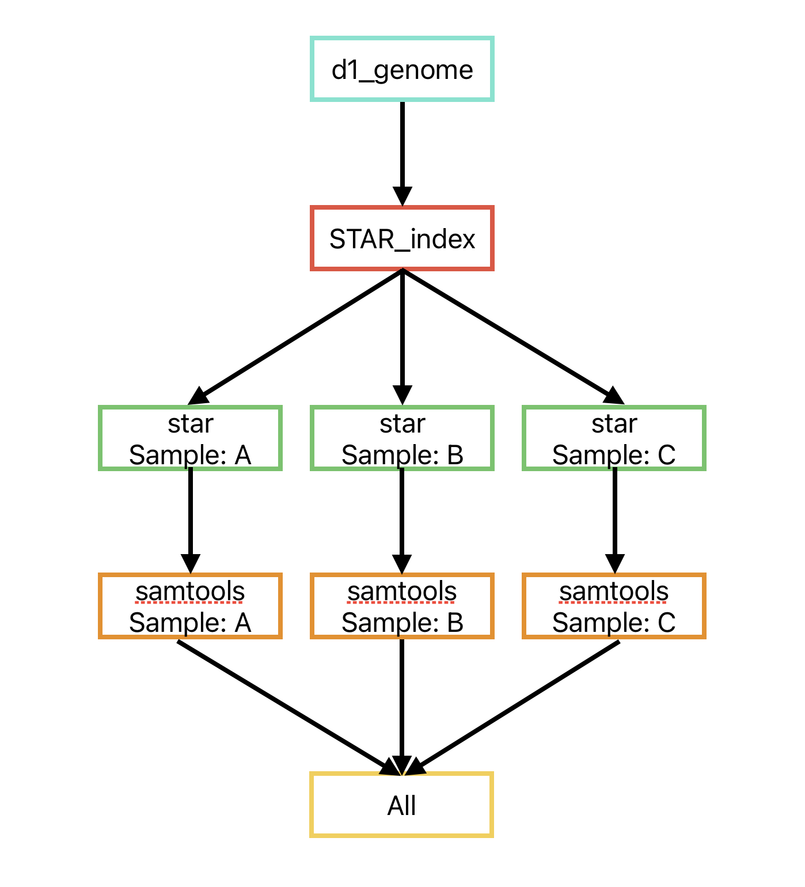

# Project 1 - Discussion Questions
Since we’ve used the first project as practice, these questions are meant to
help me assess how well I’ve conveyed some of the material as well as challenge
you to think conceptually about some of the underlying science. All of these
questions can be answered in a few sentences so do your best to be concise.

Remember, I will evaluate and give you feedback on your answers and allow you to
resubmit. As long as you address all of the comments in your resubmission, you
will receive full credit for this first project.

Open a Rstudio session to work on these questions. You may display any included
images by clicking on the `run current chunk` option for any r blocks that have
an `include_graphics` command in knitr. 

## Snakemake

Consider the following sample snakemake workflow and assume the files A.fq,
B.fq, and C.fq exist in the current working directory. (N.B. Some of these
commands in shell may not technically run, but the logic of the snakefile is
correct)

```
fa_fn = ‘ncbi_dataset/data/GCF_000001635.27/chr19.fa
gtf_fn= ‘ncbi_dataset/data/GCF_000001635.27/genomic.gtf
star_index = ‘Chr19_STAR_index’
FILES = [‘A’, ‘B’, ‘C’]

rule all:
	input:
		expand(‘{sample}.Aligned.out.bam’, sample=FILES)

rule dl_genome:
	output:
		fa = fa_fn,
		gtf = gtf_fn
	shell:
		‘’’
		datasets download genome accession GCF_000001635.27 
    –include gtf, genome
    –chromosomes 19
    
		unzip ncbi_dataset.zip
		‘’’

rule STAR_index:
	input:
		fa = fa_fn,
		gtf = gtf_fn,
	output:
		index=directory(star_index)
	threads: 4
	shell:
		‘’’
		STAR –runMode genome generate \
		–genomeDir {output.index} \
		–genomeFastaFiles {input.fa} \
		–sjdbGTFfile {input.gtf}
		‘’’
		
rule star:
	input:
		fq=’{sample}.fq’,
		index=’Chr19_STAR_index’
	output:
		‘{sample}.Aligned.out.bam’
	params:
		prefix = ‘{sample}.’
	shell:
		‘’’
		STAR –genomeDir {input.index} \
    –readFilesIn {input.fq} \
    –outSAMtype BAM Unsorted \
    –outFileNamePrefix {params.prefix}
    ‘’’
```

1. We’ve talked in class about how you can represent snakemake workflows visually.
Technically speaking, snakemake creates a directed acyclic graph that represents
the workflow. Draw the DAG for this sample snakemake workflow. Boxes indicate
the rules, and arrows indicate dependencies. Make this diagram in whatever
software you'd like and save it to this repo. Fill in the following code with the
name of the file you created and it will display it here in this markdown.

```{r, your image here}

```


2. Write a valid snakemake rule that would run samtools sort on the outputs from
rule star. Name the outputs of this rule with the extension _sorted.bam.

rule samtools_sort:
    input:
        bam = "{sample}.Aligned.out.bam"
    output:
        sorted_bam = "{sample}_sorted.bam"
    shell:
        "samtools sort -o {output.sorted_bam} {input.bam}"


3. Assume that we change our rule all input to be the following:
	
		expand(‘{samples}_sorted.bam’, samples=FILES)	

Re-draw the DAG assuming your rule from part 2 works as expected. Display it 
here using the following code:

```{r, your image here}

```


## RNAseq

1. List the major high-level steps of a basic RNAseq experiment to look for
differentially expressed genes. At each step, list what data you need to perform
each step and what format they are in (if applicable). At minimum, there are 4
essential steps.
 
(i) SAMPLE PREPARATION AND RNA EXTRACTION:
-Biological samples and total RNA extracted from each sample. 

(ii) PREPARE DATA:
-Prepare the data for the experiment's pipeline. 
-This initially inlcudes the fastq files, reference genome (fa) and annotation files (gtf). 

(iii) QUALITY CONTROL:
-Perform quality control. Create fastqc and multiqc rules to generate comprehensive qc reports (html). 

(iv) ALIGN READS TO GENOME:
-Use the prebuilt star index for the reference genome and use star rule to align reads from 
each sample against the reference genome which will give the aligned files (bam). 
-Perform post-alignment QC using samtools flagstat to assess the overall mapping rate of the alignments (txt).

(v) COUNT ALIGNMENTS, MAP GENE IDS TO GENE SYMBOLS, AND FILTER COUNTS MATRIX:
-Use verse to count the alignments falling into exonic regions for each sample (txt). 
-Concatenate the output from verse for all samples into a single counts matrix using a python script run by snakemake (csv). 
-Use a python script to parse the GTF file and extract mappings of gene IDs to gene symbols (txt). 
-Create a snakemake rule to execute the Python script and generate the mapping file. 
-Next, use a Python script to filter the counts matrix, retaining only genes expressed in all samples (csv).

(vi) PERFORM DIFFERENTIAL EXPRESSION:
-Utilize R and DESeq2 to perform differential expression analysis between the undifferentiated (P0) and 
fully differentiated (AD) timepoints. 
-Read in the counts matrix, create a dataframe with sample information, and perform differential expression analysis. 
-Merge the results with gene IDs and gene symbols for interpretation.


2. Consider the following FastQC plot.

```{r}
knitr::include_graphics("fastqc_plot.png")
```


2a. What aspect of the data does this plot show?

-The plot shows the per-sequence GC content of the sequencing reads. It displays the distribution of GC content 
across all sequences in the dataset. It's useful for assessing the quality of the sequencing data and detecting
any biases or anomalies in the GC content distribution which could indicate issues such as PCR bias or contamination.

2b. Make an interpretation of this plot assuming the data type was RNASeq.

-The peaks in the plot indicate the presence of two main groups of sequencing reads with distinct GC content profiles. 
-The first peak, occurring at lower GC content values (around 20 on the x-axis), suggests a set of reads with relatively low GC content.
-The second peak, occurring at higher GC content values, indicates another set of reads with higher GC content.
-Two distinct peaks indicate that they belong to two different populations of sequences with different GC contents.

2c. Do you think this plot indicates there was a problem with the dataset?
Explain your answer.

-Yes, the presence of two distinct peaks in the GC content plot indicates that the GC content across the dataset is not uniform. 
-This deviation from the expected distribution suggests the presence of biases or other systematic errors in the dataset.
-The appearance of two peaks could be indicative of several problems with the dataset, such as PCR biases, contamination, 
sequencing errors, or sample-specific issues. These issues can lead to inaccuracies in downstream analyses and interpretations.

3. What is a splice-aware aligner? When is it important to use a splice-aware
aligner?

-A splice-aware aligner is a tool that accounts for the presence of splice junctions when aligning RNA sequencing reads to a reference genome.
-It's important to use a splice-aware aligner for RNA-Seq data because it accurately aligns reads spanning multiple exons, detects alternative 
splicing, quantifies gene expression, and identifies novel splice variants.

4. What does a “gene-level” count as produced by VERSE or any other counting
tool in a RNAseq experiment represent?

-A "gene-level" count produced by VERSE or any other counting tool in an RNAseq experiment represents the number of sequencing reads that align 
to a specific gene. These counts provide a measure of the expression level of each gene in the sample.

5. In your own words, briefly describe what information the matching GTF for a
reference genome stores.

-A reference genome's corresponding GTF contains detailed gene annotations such as details on gene loci, exons, transcripts, and other genomic properties. 
-It has information on gene locations on the genome, transcript structure (including exons, introns, and UTRs), and other features including gene names, 
IDs, and functional annotations. 

6. When counting alignments using VERSE or any other utility, why do we need to
provide the matching reference genome GTF file?

-Gene locations and exon annotations are among the crucial genomic feature annotations found in the GTF file.
-During alignment counts, it guarantees that readings are accurately assigned to certain genomic regions.

7. Let’s pretend that this was a GSEA result from an experiment where we treated
293T cells with a drug and compared changes in gene expression to wild-type
cells treated with a vehicle control. The differential expression results are
relative to the control cells (i.e. a positive fold change means a gene is
upregulated upon treatment with the drug)

Assume the following result is statistically significant with a positive NES
(normalized enrichment score) and that it represents a GSEA experiment performed
on the entire list of genes discovered in the experiment ranked by
log2FoldChange (i.e. genes that are “upregulated” in the cells treated with drug
are on the “left” and genes that are “downregulated” due to treatment are on the
“right”).

```{r}
knitr::include_graphics("gsea_plot.png")
```


7a. Form a valid interpretation / conclusion of the results shown in the plot
given the above setup.

-The genes that are upregulated after receiving the drug seem to be enriched at the top of the sorted list, whereas the genes that are downregulated 
after receiving the drug seem to be enriched at the bottom. The positive normalized enrichment score (NES) indicates that the therapy is linked to an 
elevation of certain biological pathways or gene sets. Therefore, it's possible that the drug causes certain alterations in gene expression which 
activate these gene sets or pathways.

7b. Now consider that all of the genes driving the enrichment are all activators
of the inflammatory pathway. Does your interpretation change and if so, how?

-Yes, it would change. It would mean that the drug activates genes associated to inflammation if all of the enriched genes are activators of the inflammatory pathway. 
-This implies that the medication may affect how cells respond to inflammation.

7c. Finally, consider that all of the genes driving the enrichment all function
to inhibit inflammation. Does your interpretation change and if so, how?

-If all the enriched genes are inhibitors of inflammation, the interpretation would suggest that the drug possibly suppresses the inflammatory response in cells.
-This implies that the drug might have anti-inflammatory effects.


## O’Meara et al. Transcriptional Reversion of Cardiac Myocyte Fate During
Mammalian Cardiac Regeneration. Circ Res. Feb 2015. PMID: 25477501


1. Write out a methods section describing what steps of the analysis you performed
and which tools you used. Style this section as you would find a methods section
in a scientific publication. Remember to include the important details that
would allow a third party to reproduce your exact analysis. You can safely
exclude details that do not affect the underlying results.

METHODS:

Experimental Design:
-A basic RNAseq experiment was conducted to investigate differentially expressed genes during mammalian cardiac regeneration, 
focusing on the transcriptional reversion of cardiac myocyte fate. The analysis was based on data published by O'Meara et al. in their study titled 
"Transcriptional Reversion of Cardiac Myocyte Fate During Mammalian Cardiac Regeneration". The dataset used in this analysis comprised samples from postnatal day 0 (P0), 
postnatal day 4 (P4), postnatal day 7 (P7), and adult mouse heart ventricle cells.

Conda Environment Setup:
-A Conda environment was created specifically for the project, containing the necessary packages for analysis. 
The following packages were installed using Conda: snakemake, pandas, fastqc, star, samtools, multiqc, verse, bioconductor-deseq2, bioconductor-fgsea, and jupyterlab.

Data Preprocessing and Quality Control:
-Basic quality control was performed on FASTQ files using FastQC. A Snakemake workflow (week1.snake) was developed to run FastQC on each of the 16 FASTQ files (8 samples).
Alignment of reads to the mouse reference genome (GRCm39) was carried out using STAR. A Snakemake rule was created to download the reference genome and annotation files from GENCODE.
Alignment files were generated in BAM format and subjected to post-alignment quality control using samtools flagstat.

Gene Expression Quantification:
-Gene expression quantification was performed using VERSE to count alignments falling into exonic regions. A Snakemake rule was developed to run VERSE on each of the 8 BAM files, 
generating counts files for each sample. The counts files were concatenated into a single counts matrix using a custom Python script (concat_df.py), followed by filtering to remove 
genes not expressed in all samples. Another Python script (filter_cts_mat.py) was used for this purpose. Mapping of gene IDs to gene symbols was achieved by parsing the GTF file
using a custom Python script (parse_gtf.py).

Differential Expression Analysis:
-Differential expression analysis was performed using DESeq2 in R. The counts matrix generated was imported into R, and sample information (coldata) was prepared, including the timepoints 
for each sample. Differential expression analysis was conducted comparing the P0 and adult (AD) timepoints, and results were saved to a tibble. Gene names were then mapped to the results 
matrix using the gene ID-to-symbol mapping obtained earlier.

Visualization:
-Visualization of differential expression results and quality control metrics were performed using appropriate plots and visualizations generated in RMarkdown notebooks. 
MultiQC was used to generate comprehensive reports summarizing the results from FastQC and other quality control tools.

Computational Resources:
-All analyses were conducted on the Shared Computing Cluster (SCC), with appropriate computing resources requested using Snakemake and the SGE scheduler. 
Execution of Snakemake workflows on the full data files required careful resource management to avoid overloading the cluster.

Code Availability:
-All custom scripts, Snakefiles, and RMarkdown notebooks used for analysis are available in the project directory and GitHub repository for reproducibility and transparency.

2. Why did the authors perform RNAseq on these specific samples? What was their
goal in doing so?

-The authors performed RNAseq on specific samples, including embryonic stem cell differentiation, in vivo maturation models, 
and ex vivo cultured cardiac myocytes, to characterize the transcriptional events occurring during cardiac regeneration in neonatal mice. 
-Their goal was to identify the molecular mechanisms underlying the process of cardiac myocyte regeneration and to identify key gene expression 
changes associated with the reversion of cardiac myocyte fate during regeneration

3. Using either your GSEA results OR your replication of Figure 1D, draw a conclusion
about the main result this RNAseq experiment shows. Do your results generally
agree with those of the original publication?

-The RNAseq experiment reveals significant changes in gene expression profiles associated with pathways related to differentiation, signaling, transport, cancer, immune response, and metabolism.
The differential regulation of these pathways suggests a dynamic transcriptional reprogramming process occurring during cardiac regeneration and cellular fate changes.

-The GSEA results generally align with the findings of the original publication. The original study also highlighted transcriptional reversion of cardiac myocyte fate during mammalian cardiac regeneration, 
indicating a shift in gene expression patterns associated with differentiation and maturation.

-Overall, the GSEA results support the original publication's findings regarding transcriptional reversion of cardiac myocyte fate during mammalian cardiac regeneration, 
highlighting the importance of gene expression dynamics in driving cellular plasticity and regeneration processes.

4. List at least two reasons why your results may be **slightly** different than
those found in the original publication.

-Variations in the specific methods used for data processing, normalization, and analysis could lead to slight discrepancies in the results.
-Differences in parameter settings, software versions, or statistical approaches in the GSEA analysis may result in variations in the identification and interpretation of enriched pathways.


